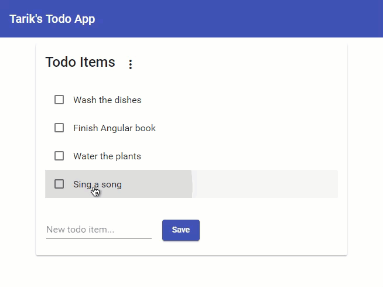

# ToDo App

> This app is still under occasional development; hence, the `readme.md` file may not be totally up-to-date. The code itself will explain the true capabilities. Therefore, please refer to the source code for more complete information.

This application is written for the purpose of an exercise. It uses various Angular elements such as **Modules**, **Components**, **Routing**, **Route Guards**, etc. 

Check out the source code to learn more about it.

The application contains only front-end and does not interact with any server side. 

### Note
Strictly speaking, this application was developed with Angular 7.
It was then updated and tested in Angular 8, which was then updated and tested in Angular 9.0.0-rc.0. Therefore, I cannot guarantee that it will work with the other versions of Angular.

# How to run?

- Clone it with `git clone https://github.com/tarikguney/todoapp.git` (or `git clone git@github.com:tarikguney/todoapp.git` if you have SSH installed.)
- Make sure you have Angular CLI installed. If you don't have it, then run `npm install @angular/cli` to install it.
- Install all of the dependencies by running `npm install` in the same directory this project resides on your local machine.
- Run `ng serve` in the location where `todoapp` source code resides. Angular, by default, uses `4200` port. You can change it by passing `--port [portnumber]` flag. For instance, `ng serve --port 4201`
- Visit the web site the Angular CLI started. Usually the website is `locahost:4200` unless you specified a different port number.

## Take a peek

You can find more information about the Angular CLI here: https://angular.io/cli

Developed by @tarikguney.

